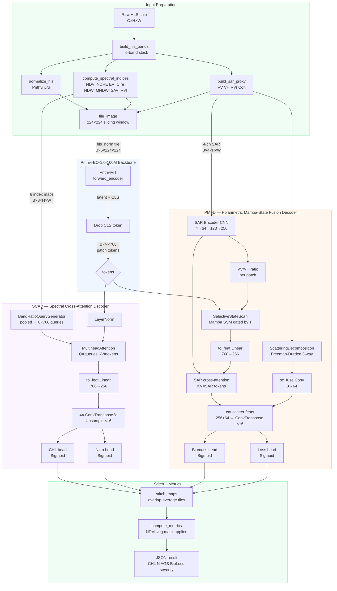

# Crop Health Monitor

Biophysical crop-health estimation from Harmonized Landsat Sentinel-2 (HLS) multispectral imagery. Uses **Prithvi-EO-1.0-100M** (IBM / NASA) as a pretrained ViT backbone with two custom task-specific decoders, a Flask REST API with Server-Sent Events streaming, and a Leaflet map frontend for AOI-based inference.

---

## Model Architecture

### Component Table

| Component | Input Size | Output Size | Function (≤10 words) |
|---|---|---|---|
| **PrithviBackbone** | `(B, 6, 224, 224)` | `(B, N, 768)` | Encodes HLS patches into contextual token embeddings |
| **BandRatioQueryGenerator** | `(B, 8, H, W)` | `(B, 8, 768)` | Generates spectral-state queries from pooled index maps |
| **SpectralCrossAttentionDecoder (SCAD)** | `(B, N, 768)` + `(B, 8, H, W)` | `(B, 1, H, W)` × 2 | Cross-attends tokens with band-ratio queries; outputs CHL + N |
| **ScatteringDecomposition** | `(B, 4, H, W)` | `(B, 3, H, W)` | Learnable Freeman-Durden SAR surface/volume/bounce fractions |
| **SelectiveStateScan (SSM)** | `(B, N, 768)` + ratio `(B, N)` | `(B, N, 768)` | VV/VH-gated Mamba SSM over spatial patch token sequence |
| **PolarimetricFusionDecoder (PMFD)** | `(B, N, 768)` + `(B, 4, H, W)` | `(B, 1, H, W)` × 2 | Fuses SAR + tokens via SSM; outputs biomass + loss |
| **DualTaskCropHealthModel** | `(B, 6, H, W)` | 4 × `(B, 1, H, W)` | Shared backbone branches into SCAD and PMFD in parallel |

> `B` = batch, `N` = patch tokens (49 with T=1, side=7), `H/W` = spatial dims, `8` = spectral query count.  
> Decoder output spatial size = `int(√N) × 2⁴`. With N=49 → side=7 → output=112×112, upsampled to input during stitching.

---

### Mermaid Pipeline



---

## Project Structure

```
godal/
├── config.py            All hyperparameters, constants, paths
├── ablation.py          AblationConfig dataclass, AblationOutput, 11 variant list
├── model.py             PrithviBackbone, SCAD, PMFD, DualTaskCropHealthModel
├── data_processing.py   Band prep, normalization, SAR proxy, indices, tiling
├── data_loading.py      HuggingFace download, ChipDataset, DataLoader factory
├── inference.py         process_chip, stitch_maps, compute_metrics, run_chip_analysis
├── ablation_runner.py   Standalone ablation study → ablation_report.json
├── training.py          Pseudo-label training loop, frozen/unfreeze phases
├── utils.py             Print helpers, render_chip_panel, bar chart, scatter
├── main.py              Flask API — SSE streaming, AOI inference, chip registry
├── temp.py              Download 6 sample chips → sample_data/ + manifest.json
├── choloro.ipynb        Jupyter notebook 
├── requirements.txt     Python dependencies 
├── .env                 HF_TOKEN, DEVICE, API_PORT
├── index.html           Single-page app (root level, loads frontend/* assets)
├── frontend/
│   ├── style.css        Responsive layout, light theme, glow effects, mobile icons
│   └── app.js           Leaflet.js map, Leaflet.draw, SSE client, color-coded metrics
└── sample_data/
    ├── manifest.json    Chip metadata with WGS84 bounds (auto-generated)
    └── *.tif            6 sample HLS chips (auto-downloaded)
```

---

## Installation

**From requirements.txt:**
```bash
pip install -r requirements.txt
```

**GPU support (recommended):**
```bash
pip install torch torchvision --index-url https://download.pytorch.org/whl/cu121
```

---

## Quick Start

**1. Configure environment**

```bash
cp .env .env.local
# Edit .env and set your HuggingFace token
HF_TOKEN=hf_xxxxxxxxxxxxxxxxxxxx
DEVICE=cuda
API_PORT=5000
```

**2. Download sample chips**

```bash
python temp.py
```

Downloads `validation_chips.tgz` from HuggingFace, extracts 6 chips into `sample_data/`, reads real WGS84 bounds via rasterio, and writes `sample_data/manifest.json`.

**3. Start the API**

```bash
python main.py
```

Open `http://localhost:5000` in your browser.

---

## Web Interface

The frontend is a single-page app served directly by Flask from the root `index.html`.

```
GET  /                   → index.html (root level)
GET  /frontend/style.css → frontend/style.css
GET  /frontend/app.js    → frontend/app.js
```

### Layout & Features

- **Desktop (≥700px):** Map on right side (flex: 1), sidebar panel on left (380px)
- **Mobile (<700px):** Stacked layout with map above (55vh) and controls below (45vh)
- **Responsive icons:** Font Awesome icons with help tooltips on mobile (4-6 word descriptions)
- **Color-coded metrics:** Each metric card displays a colored border based on health status:
  - **Green border** = Healthy values (e.g., Veg ≥70%, Chl Stress <20%)
  - **Orange border** = Caution values (moderate ranges)
  - **Red border** = Critical values (poor indicators)
- **Ground-truth vegetation:** Displays GT vegetation % instead of model prediction for accuracy
- **Real-time status:** Colored dot indicator (green = ready, amber = processing, red = error)

### User flow

```
1. Page loads
   └── GET /api/v1/chips
       └── Orange dashed rectangles appear on Esri satellite map at real chip coordinates

2. Select chip from dropdown
   └── Map zooms to chip bounds
   └── Previous AOI / results cleared

3. Click "Draw AOI" (icon: square on mobile)
   └── Leaflet.draw rectangle mode activates
       └── Drag a rectangle within the selected chip

4. Drawn bounds populate the coordinate panel (W / S / E / N)
   └── Validation error if AOI outside chip bounds
   └── "Run Inference" button activates with glow

5. Click "Run Inference" (icon: play on mobile)
   └── POST /api/v1/analyze/aoi  { west, south, east, north }
       └── Server finds intersecting chip tiles, starts background thread
           └── Returns { job_id }, shows progress card

6. EventSource /api/v1/stream/{job_id}   ← SSE
   └── Events: status → progress → progress … → result → done
       └── Progress bar fills, status dot pulses amber
       └── 15-second watchdog detects stalled connections

7. SSE "result" event
   └── Blue AOI rectangle overlaid on map
   └── Leaflet popup opens with chip metrics summary
   └── Metrics panel populates with color-coded borders (green/orange/red)
   └── **Ground-truth vegetation displayed** (GT proxy from rasterio)
   └── Status dot goes steady green
   └── Details section expands (Chl GT, AGB GT, error metrics)
```

---

## REST API

### Base URL

```
http://localhost:5000/api/v1
```

### Endpoints

| Method | Path | Description |
|--------|------|-------------|
| `GET` | `/health` | Server + model status |
| `GET` | `/model/info` | Param counts, strategy, checkpoint |
| `GET` | `/chips` | All sample chips with WGS84 bounds |
| `POST` | `/analyze/aoi` | Start AOI inference → `job_id` |
| `GET` | `/stream/{job_id}` | SSE event stream for job |

---

#### `GET /api/v1/health`

```json
{
  "status": "ok",
  "api_version": "v1",
  "device": "cuda",
  "model_ready": true,
  "chips_loaded": 6
}
```

---

#### `GET /api/v1/chips`

```json
{
  "status": "ok",
  "count": 6,
  "chips": [
    {
      "id": "chip_002_060",
      "filename": "chip_002_060_merged.tif",
      "path": "/abs/path/sample_data/chip_002_060_merged.tif",
      "crs": "EPSG:32614",
      "width_px": 224,
      "height_px": 224,
      "n_bands": 18,
      "bounds": { "west": -94.231, "south": 41.882, "east": -94.163, "north": 41.944 },
      "center": { "lat": 41.913, "lon": -94.197 },
      "band_means_b02_b03_b04": [812.4, 1024.7, 1198.3]
    }
  ]
}
```

---

#### `POST /api/v1/analyze/aoi`

**Request body:**
```json
{
  "west":  -94.22,
  "south":  41.89,
  "east":  -94.17,
  "north":  41.93,
  "ablation": false
}
```

**Response:**
```json
{ "status": "ok", "job_id": "a3f7c2d1-..." }
```

---

#### `GET /api/v1/stream/{job_id}`   — SSE

Events are newline-delimited JSON on the `data:` field.

| Event `type` | Payload fields | Meaning |
|---|---|---|
| `status` | `message` | Human-readable stage label |
| `progress` | `value` (0–1), `message` | Progress bar update |
| `warning` | `message` | Non-fatal issue (tile capped, skip) |
| `result` | `chip_id`, `bbox`, `metrics`, `gt_proxies`, `error_chlorophyll`, `error_biomass`, `severity_color` | Final per-chip result |
| `error` | `message` | Fatal error, stream ends |
| `done` | — | All chips processed |

**Example result event `metrics` object:**
```json
{
  "image_size_px": [224, 224],
  "total_pixels": 50176,
  "vegetation_coverage_pct": 68.4,
  "stressed_area_pct": 12.3,
  "biomass_loss_area_pct": 8.7,
  "chlorophyll_ug_cm2": 41.2,
  "chlorophyll_pct_healthy": 51.5,
  "chlorophyll_stress_pct": 48.5,
  "n_concentration_pct": 2.31,
  "n_normalized_pct": 51.3,
  "biomass_agb_mgha": 98.4,
  "biomass_pct_of_max": 39.4,
  "biomass_loss_mgha": 22.1,
  "biomass_loss_pct": 27.6,
  "stress_severity": "MILD"
}
```

**curl example:**
```bash
# Start job
JOB=$(curl -s -X POST http://localhost:5000/api/v1/analyze/aoi \
  -H "Content-Type: application/json" \
  -d '{"west":-94.22,"south":41.89,"east":-94.17,"north":41.93}' \
  | python3 -c "import sys,json; print(json.load(sys.stdin)['job_id'])")

# Stream events
curl -N http://localhost:5000/api/v1/stream/$JOB
```

---

## Training

Trains SCAD + PMFD decoders against spectral-index pseudo-labels derived from the real HLS bands. No manual annotation required.

### Pseudo-label derivation

| Output head | Proxy formula | Reference |
|---|---|---|
| Chlorophyll | CIre = (B07 / B05) − 1, clipped to [0, 1] | Gitelson et al. (2003) |
| Nitrogen | NDRE = (B07 − B05) / (B07 + B05), scaled to MAX_N_PERCENT | — |
| Biomass | 0.7 × NDVI_clipped + 0.3 × (B07 / B07_max) × 120 / 250 | Foody et al. (2003) |
| Biomass loss | 1 − NDVI_clipped | — |

### Training phases

| Epoch range | Backbone | Decoder LR | Backbone LR |
|---|---|---|---|
| 1 → `UNFREEZE_EPOCH` (5) | **Frozen** | 3e-4 | — |
| `UNFREEZE_EPOCH+1` → end | **Active** | 3e-4 | 3e-5 |

Loss is a weighted MSE sum with vegetation pixels upweighted 1.5×.

```bash
python training.py
```

Config keys in `config.py`:

| Key | Default | Description |
|---|---|---|
| `EPOCHS` | 30 | Total epochs |
| `TRAIN_BATCH` | 8 | Batch size |
| `LR_DECODERS` | 3e-4 | Decoder learning rate |
| `LR_BACKBONE` | 3e-5 | Backbone fine-tune LR |
| `UNFREEZE_EPOCH` | 5 | Epoch backbone unfreezes |
| `GRAD_CLIP` | 1.0 | Gradient norm clip |
| `W_CHL` | 1.0 | Chlorophyll loss weight |
| `W_NITRO` | 1.0 | Nitrogen loss weight |
| `W_BIO` | 1.0 | Biomass loss weight |
| `W_LOSS` | 0.8 | Biomass-loss head weight |

Checkpoints → `output/trained_model.pt` and `output/best_model.pt`.

---

## Ablation Study

Quantifies each component's contribution by zeroing inputs or disabling modules, measuring mean absolute delta vs. the full-model baseline prediction.

```bash
python ablation_runner.py          # writes output/ablation_report.json
```

Or per-request via the API:
```bash
curl -X POST "http://localhost:5000/api/v1/analyze/aoi?ablation=true" \
     -H "Content-Type: application/json" \
     -d '{"west":-94.22,"south":41.89,"east":-94.17,"north":41.93}'
```

### Variants

| Variant | What changes | Affected heads |
|---|---|---|
| Full model (baseline) | — | — |
| -SAR input | All SAR channels = 0 | PMFD |
| -Spectral indices | All 8 index maps = 0 | SCAD |
| -NIR proxy (B07) | B06, B07 = 0 | Both |
| -Red-edge (B05-B07) | B05, B06 = 0 | Both |
| -Red band (B04) | B04 = 0 | Both |
| -SCAD decoder | CHL + N output = zeros | SCAD |
| -PMFD decoder | Biomass + loss = zeros | PMFD |
| -SSM (Mamba gate) | SSM → linear bypass | PMFD |
| -Scatter decomp | Uniform 1/3 allocation | PMFD |
| -Cross-attention | SCAD direct projection | SCAD |

---

## Output Files

| File | Contents |
|---|---|
| `sample_data/manifest.json` | Chip metadata with real WGS84 bounds |
| `sample_data/*.tif` | 6 downloaded HLS chips (224×224, 18 bands) |
| `output/best_model.pt` | Best validation checkpoint |
| `output/trained_model.pt` | Final epoch checkpoint |
| `output/panel_maps.png` | Natural color / false color / NDVI grid |
| `output/metrics_bar.png` | Per-chip metric bar chart |
| `output/correlation_scatter.png` | Pred vs GT proxy scatter plots |
| `output/ablation_report.json` | Full ablation delta table |
| `choloro.ipynb` | Jupyter notebook for interactive analysis & visualization |

---

## Dataset

**ibm-nasa-geospatial/multi-temporal-crop-classification** — Apache-2.0

- 224 × 224 GeoTIFF chips at 30 m/pixel
- ~1.18 GB validation archive · ~4 GB training archive
- Auto-downloaded to `./data/` on first run

---

## References

- Jakubik et al. (2023). *Foundation Models for Generalist Geospatial Artificial Intelligence.* arXiv:2310.18660
- Cecil et al. (2023). *ibm-nasa-geospatial/multi-temporal-crop-classification.* doi:10.57967/hf/0955
- Gitelson et al. (2003). *Remote estimation of chlorophyll content in higher plant leaves.* Int. J. Remote Sensing 24(13).
- Foody et al. (2003). *Predictive relations of tropical forest biomass from Landsat TM data.* Remote Sensing of Environment.
- McNairn & Brisco (2004). *The application of C-band polarimetric SAR for agriculture.* Canadian Journal of Remote Sensing.
- Gu et al. (2023). *Mamba: Linear-Time Sequence Modeling with Selective State Spaces.* arXiv:2312.00752
