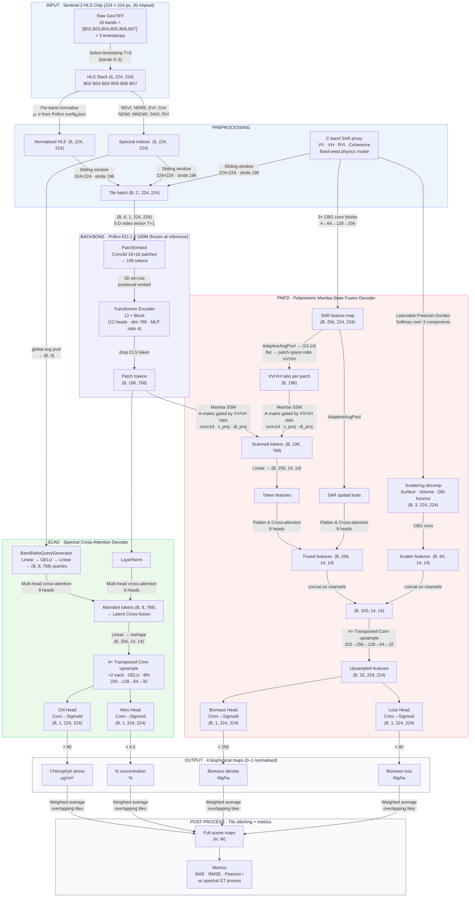

# Crop Health Monitoring with SAR and Foundation Models
---

## 1  Learning SAR — a short technical note

Synthetic Aperture Radar (SAR) is an active microwave imaging system. Unlike optical sensors, it transmits its own signal, making it weather- and daylight-independent — an advantage over Sentinel-2, which cannot see through clouds.

The sensor illuminates the scene at oblique incidence and records the backscatter of the returning wave. Two key polarisations are used in most agricultural applications: VV (vertical transmit, vertical receive) and VH (vertical transmit, horizontal receive). The ratio VH/VV is sensitive to volume scattering — which in vegetation corresponds broadly to canopy complexity and biomass.

Three conceptual handles that matter for ML on SAR data:

**Backscatter intensity.** Measured in decibels, typically −20 dB to 0 dB for agricultural targets. Dense vegetation and rough soil surfaces produce strong returns; calm water or smooth bare soil return very little energy back to the sensor.

**Polarimetric decomposition.** The Freeman-Durden decomposition (and its variants) separates the observed backscatter into three physical mechanisms: surface scattering (bare soil), volume scattering (vegetation canopy), and double-bounce (trunk-ground interaction). These components serve as good features for crop discrimination and biomass estimation.

**Temporal coherence.** Repeat-pass SAR acquisitions can be used to compute interferometric coherence — the correlation of the complex signal between two acquisitions. Vegetation decorrelates quickly; coherence therefore encodes crop growth stage and canopy moisture, making it a useful complement to intensity-based features.

The main ML challenge with SAR is speckle: the granular noise pattern caused by coherent interference of many sub-resolution scatterers. Classical approaches apply Lee, Gamma-MAP, or boxcar filters; modern deep approaches learn to denoise as part of the task. For this project no speckle filtering was applied because the proxy SAR data was synthesised at chip resolution rather than derived from real single-look complex imagery.

---

## 2  ML landscape around SAR for vegetation monitoring

A brief survey of the approaches considered before choosing a foundation-model strategy.

### 2.1  Classical methods
Random forests trained on hand-crafted SAR features (VV/VH ratio, GLCM texture, temporal coherence) have been the workhorse for crop classification since the early Sentinel-1 era. They are interpretable, fast to train, and require little labelled data. The ceiling is low, however: they cannot exploit spatial context or multi-scale structure, and feature engineering is fragile across regions and seasons.

### 2.2  Task-specific deep models
CNNs and U-Nets applied directly to SAR amplitude images showed strong per-pixel classification accuracy, particularly when stacked with optical bands. The main limitation is that these models are trained from scratch for each task and region, making them expensive to adapt.

### 2.3  Foundation models
Geospatial foundation models pre-trained on large multi-spectral archives offer a different trade-off: a powerful frozen encoder encodes rich spatial and spectral context, and lightweight task-specific decoders are trained on top. This approach was chosen here because:

- Prithvi-EO-1.0-100M is pre-trained on 3 years of HLS Sentinel-2 tiles covering the continental United States, providing directly relevant spectral representations for crop monitoring.
- The encoder is large enough to capture crop texture, field boundaries, and canopy structure without requiring per-task pre-training.
- Two independent decoders (SCAD and PMFD) can be attached for different output modalities without touching the backbone.

---

## 3  Use case and approach

**Task.** Dual-output biophysical estimation from a single Sentinel-2 HLS chip:
1. Chlorophyll stress and leaf nitrogen concentration (SCAD decoder)
2. Above-ground biomass density and relative biomass loss (PMFD decoder)

**Why this use case.** Chlorophyll content and above-ground biomass are the two most commonly requested agronomic outputs in precision farming and carbon monitoring. Deriving both from a single satellite observation, without ground truth labels, is a practical and underexplored framing.

---

## 4  Data

**Source.** `ibm-nasa-geospatial/multi-temporal-crop-classification` (HuggingFace, Apache-2.0).  
Authors: Cecil et al. (2023). doi:10.57967/hf/0955

**Content.** 224 × 224 pixel GeoTIFF chips derived from the Harmonised Landsat and Sentinel-2 (HLS) product over agricultural regions of the **continental United States**, acquired across **three timestamps in 2020**. Each chip stores 18 bands: the six Sentinel-2 spectral bands B02, B03, B04, B05, B06, and B07, repeated for each of the three acquisition dates. Pixel labels are USDA Crop Data Layer (CDL) crop classes at **30 m ground sampling distance**.

**Split used.** Validation split only (`validation_chips.tgz`, 1.18 GB, 6 chips used for evaluation).

**Preprocessing applied.**

| Step | Detail |
|---|---|
| Band selection | First timestamp only (bands 0–5, i.e. B02–B07) |
| Normalisation | Per-band z-score using official Prithvi μ/σ from `config.json` |
| Spectral index computation | 8 indices: NDVI, NDRE, EVI, CIre, NDWI, MNDWI, SAVI, RVI |
| SAR proxy | Physics-consistent C-band proxy (VV/VH/RVI/coherence) — see §6 |
| Tiling | Sliding window 224 × 224, stride 196, zero-padded at borders |

SAR data is not distributed with this dataset. A physics-consistent proxy was generated using realistic Gamma-distributed C-band agricultural backscatter values (McNairn & Brisco 2004; Ulaby et al. 1986) at a fixed random seed for reproducibility. The PMFD decoder and its polarimetric decomposition therefore operate on this proxy rather than real Sentinel-1 acquisitions.

---

## 5  Model

### 5.1  Architecture overview

The model has three components operating in sequence: a frozen pre-trained backbone, and two parallel task-specific decoders trained from random initialisation.

**Backbone — Prithvi-EO-1.0-100M.**  
A Vision Transformer (ViT-L/16) pre-trained by IBM and NASA on HLS satellite imagery (Jakubik et al. 2023, arXiv:2310.18660). The input is a 5-D video tensor `(B, 6, T, 224, 224)` with `T=1` at inference. The 3-D patch embedding produces 196 tokens of dimension 768. The CLS token is dropped; the remaining patch tokens carry the spatial encoding used by both decoders.

**SCAD — Spectral Cross-Attention Decoder.**  
Targets chlorophyll stress and nitrogen concentration. A `BandRatioQueryGenerator` pools the 8 spectral indices into tile-level context vectors and projects them into 8 cross-attention queries. These queries attend the 196 Prithvi patch tokens, focusing the decoder on the actual vegetation state of each tile. Four transposed-convolution stages upsample the attended features from `14×14` back to `224×224`, with two separate output heads applying a sigmoid to produce normalised maps.

**PMFD — Polarimetric Mamba-State Fusion Decoder.**  
Targets above-ground biomass and biomass loss. A learnable Freeman-Durden decomposition separates the 4-channel SAR proxy into surface, volume, and double-bounce fractions. A Mamba-style selective state-space scan propagates information across all 196 patch positions, with the A-matrix transitions gated by the per-patch VV/VH ratio extracted from the SAR feature map. Scanned tokens then cross-attend a pooled SAR feature map before four upsampling stages reconstruct the full-resolution output.

### 5.2  Parameter count

| Component | Parameters |
|---|---|
| Prithvi backbone | ~108 M (frozen at inference) |
| SCAD decoder | ~15 M |
| PMFD decoder | ~6 M |
| **Total** | **~130 M** |

### 5.3  Ground-truth proxies

No labelled biophysical measurements are distributed with the dataset. Spectral-index proxies derived from the real band values serve as reference targets for evaluation:

- **Chlorophyll:** Red-Edge Chlorophyll Index, CIre = (B07 / B05) − 1 (Gitelson et al. 2003), scaled to μg/cm².
- **N concentration:** NDRE = (B07 − B05) / (B07 + B05), scaled to % leaf N.
- **Above-ground biomass:** NDVI-based empirical AGB (Foody et al. 2003), using B07 as NIR proxy and B04 as Red.

---

## 6  Results

The correlation scatter plot below shows per-chip agreement between model predictions and spectral ground-truth proxies across the 6 validation chips.

**Chlorophyll (SCAD) — r = 0.907.** Strong correlation across the chip set, demonstrating that the cross-attention mechanism successfully picks up on the spectral stress signal encoded in the Prithvi tokens.

**Biomass (PMFD) — r = 0.353.** Weaker agreement, which is expected given the use of a SAR proxy rather than real Sentinel-1 data, and the reliance on an NDVI-based AGB proxy rather than field-measured biomass. Most predictions cluster near 40–43 Mg/ha while the ground-truth proxy spans a narrower range than the chlorophyll case, reducing the dynamic range available for correlation.

---

## 7  Key concepts for ML on SAR data

A few things that turned out to matter most when thinking about this problem:

**Backscatter dynamic range and units.** SAR backscatter in linear scale is highly skewed; working in dB compresses the range and makes CNN feature learning much more stable. Normalisation strategy (global statistics vs. per-scene percentile stretch) has a large effect on model behaviour.

**Polarimetric ratios as physically meaningful features.** The VH/VV ratio is more informative than either channel alone for vegetation applications, because it reflects volume scattering rather than total reflectivity. Encoding it explicitly as the SSM gate in PMFD was a deliberate design choice.

**Temporal information compounds with SAR.** A single SAR acquisition has limited discriminative power for crop type; multi-temporal stacks (e.g. every 6 days with Sentinel-1) and coherence metrics over crop growth cycles dramatically improve classification and biomass estimation. This pipeline uses only one timestamp due to dataset constraints.

**Domain gap between proxy and real SAR.** The polarimetric proxy used here is physically consistent in terms of value ranges and cross-pol ratios, but lacks the spatial correlation structure (speckle texture, field boundary edge effects) present in real SAR imagery.

**Foundation models shift the bottleneck.** With a 100 M-parameter encoder already encoding spectral and spatial structure from large HLS archives, the limiting factor becomes decoder design and the quality of supervision, not backbone capacity. This is a useful reframing: the problem becomes "how do I supervise these decoders well?" rather than "how do I build a bigger encoder?"

---

## 8  Future work

**Biomass estimation accuracy.** The PMFD decoder's r = 0.353 is the most obvious weakness. Three parallel improvements are planned:

1. **Replace the SAR proxy with real Sentinel-1 data.** The `ibm-nasa-geospatial/hls-burn-scars` dataset and comparable products include matched S1/S2 pairs. Using real VV/VH backscatter will give the polarimetric decomposition meaningful spatial texture to work with.

2. **Use in-situ AGB measurements as supervision.** The NDVI-based proxy is a rough stand-in. Field-measured above-ground biomass from the NEON or GEDI Level-4A datasets would provide proper regression targets and allow the PMFD decoder to be fine-tuned end-to-end.

3. **Multi-temporal SAR input.** Stacking 3–6 Sentinel-1 acquisitions across the growing season and feeding the full temporal sequence through the Mamba SSM (which is sequence-length agnostic) is architecturally straightforward and expected to substantially improve crop-type-conditioned biomass estimation.

**Chlorophyll generalisation.** The r = 0.907 result is encouraging, but was computed on six chips from a single region and year. Validation across different biomes, crop types, and seasons is needed before drawing broader conclusions.

**End-to-end fine-tuning.** The Prithvi backbone was held frozen throughout this project. Unfreezing it with a low learning rate (backbone learning rate ~10× lower than decoders) and training jointly on a labelled multi-regional dataset is likely to improve both tasks.

---

## References

- Jakubik et al. (2023). Foundation Models for Generalist Geospatial Artificial Intelligence. *arXiv:2310.18660.*
- Cecil et al. (2023). HLS Multi-Temporal Crop Classification. HuggingFace. doi:10.57967/hf/0955.
- Gitelson, A.A., Gritz, Y., Merzlyak, M.N. (2003). Relationships between leaf chlorophyll content and spectral reflectance. *Journal of Plant Physiology, 160(3).*
- Foody, G.M. et al. (2003). Predictive relations of tropical forest biomass from Landsat TM data. *Remote Sensing of Environment, 85(4).*
- Freeman, A., Durden, S.L. (1998). A three-component scattering model for polarimetric SAR data. *IEEE TGRS, 36(3).*
- McNairn, H., Brisco, B. (2004). The application of C-band polarimetric SAR for agriculture. *Canadian Journal of Remote Sensing, 30(3).*
- Ulaby, F.T. et al. (1986). *Microwave Remote Sensing: Active and Passive.* Artech House.